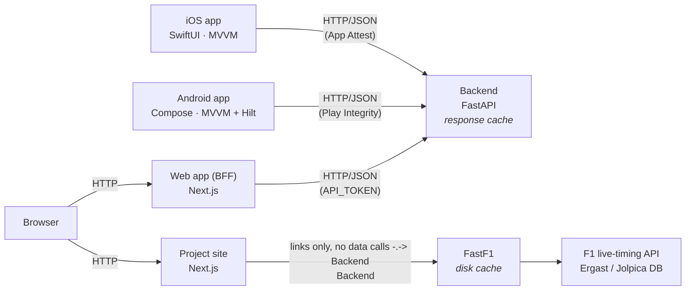

# RaceControl 🏁

Modern, **native iOS and Android apps** for exploring historical Formula 1 data: drivers,
teams, circuits, standings, full session results, and a **lap-by-lap race replay**, powered
by the [FastF1](https://docs.fastf1.dev) library (2018–present).

RaceControl is five pieces:

| Piece | Tech | Folder |
|------|------|--------|
| **iOS app** | Swift · SwiftUI (iOS 17+) | [`RaceControlApp/`](RaceControlApp/) |
| **Android app** | Kotlin · Jetpack Compose (Android 8+) | [`RaceControlAndroid/`](RaceControlAndroid/) |
| **Web app** | TypeScript · Next.js | [`RaceControlWeb/`](RaceControlWeb/) |
| **Data backend** | Python · FastAPI · FastF1 | [`backend/`](backend/) |
| **Project site** | TypeScript · Next.js | [`RaceControlSite/`](RaceControlSite/) |

Same backend, same data, same features. The iOS, Android and web apps are independent
clients of the same idea, each following its own platform's conventions rather than one
being a port of another. FastF1 is a Python library (not a hosted web service), so the
backend runs FastF1 on a server and exposes clean JSON over REST; all three apps consume it.
The web app additionally fronts the backend with a small BFF layer (see
[`RaceControlWeb/README.md`](RaceControlWeb/README.md)), since a browser can't do the device
attestation the mobile apps use.

[](https://github.com/Owl-Media/RaceControl/actions/workflows/backend-ci.yml)
[](https://github.com/Owl-Media/RaceControl/actions/workflows/android-ci.yml)
[](https://github.com/Owl-Media/RaceControl/actions/workflows/ios-ci.yml)
[](https://github.com/Owl-Media/RaceControl/actions/workflows/site-ci.yml)

### Continuous integration

Four independent GitHub Actions workflows in [`.github/workflows/`](.github/workflows/),
each path-filtered so a change to one piece doesn't run the others' checks:

| Workflow | Runs on changes to | What it does |
|---|---|---|
| `backend-ci.yml` | `backend/**` | Installs `requirements.txt` + `pytest`/`httpx`, runs `test_attest.py` and `test_attest_endpoints.py`, then imports `main.py` with no env vars to confirm the open-by-default local-dev path still boots. |
| `android-ci.yml` | `RaceControlAndroid/**` | `./gradlew testDebugUnitTest` then `./gradlew assembleDebug`; uploads the test reports as a build artifact. |
| `ios-ci.yml` | `RaceControlApp/**` | Unsigned `xcodebuild build` against `generic/platform=iOS Simulator`, on a macOS runner. |
| `site-ci.yml` | `RaceControlSite/**` | `npm ci`, `npm run lint`, `npm run build` for the project site. |

This is CI only; nothing here deploys anywhere. Deploying the backend to Coolify is still
the manual process in section 1b below, and there's no Play Store or TestFlight upload wired
up (those would need a Play Console service-account key and Apple signing certs as repo
secrets, which haven't been set up).

---

## 1. Run the backend

Requirements: Python 3.10+.

```bash
cd backend
./run.sh            # creates a venv, installs deps, starts the API
```

The API starts on **http://localhost:8000**. Open **http://localhost:8000/docs** for the
interactive Swagger UI. The first request for a given race downloads and caches its data
(FastF1 caches to `backend/.fastf1_cache/`), so it's slow once and fast thereafter.

Manual start (instead of `run.sh`):

```bash
cd backend
python3 -m venv .venv && source .venv/bin/activate
pip install -r requirements.txt
uvicorn main:app --host 0.0.0.0 --port 8000 --reload
```

### Endpoints

| Method | Path | Description |
|--------|------|-------------|
| GET | `/api/seasons` | Available seasons (2018–present) |
| GET | `/api/schedule/{year}` | Race calendar for a season |
| GET | `/api/results/{year}/{round}/{session}` | Classification (`R`, `Q`, `S`, `FP1`…) |
| GET | `/api/standings/drivers/{year}` | Driver championship standings |
| GET | `/api/standings/constructors/{year}` | Constructor standings |
| GET | `/api/drivers/{year}` | Season drivers (headshots, teams, points) |
| GET | `/api/drivers/{year}/{driverId}` | Driver detail + per-round results |
| GET | `/api/teams/{year}` | Constructors with rosters & colours |
| GET | `/api/teams/{year}/{teamId}` | Team detail |
| GET | `/api/circuits/{year}` | Circuits visited that season |
| GET | `/api/circuit/{year}/{round}` | Track outline + corners, length & fastest lap |
| GET | `/api/replay/{year}/{round}` | **Lap-by-lap running order** for the replay |
| GET | `/api/replay-positions/{year}/{round}` | Per-driver car X/Y positions sampled across each lap, for animating cars around the track outline (`/api/circuit/{year}/{round}`) during replay |
| GET | `/api/laptimes/{year}/{round}` | Per-driver lap-time series (evolution chart) |
| GET | `/api/strategy/{year}/{round}` | Tyre stints & pit-stop counts per driver |
| GET | `/api/weather/{year}/{round}/{session}` | Session weather summary plus the full cached weather timeline |
| GET | `/api/flags/{year}/{round}?session=R` | Track flags & safety-car history: raw race-control events plus collapsed lap-range periods (yellow/double-yellow/red/VSC/SC) for a flags timeline and chart overlays |
| GET | `/api/racecontrol/{year}/{round}?session=R` | The complete race-control message log — flags and safety car, but also DRS enable/disable, car events, and investigations/penalties/reprimands — in chronological order |
| GET | `/api/telemetry/{year}/{round}/{driver}` | Fastest-lap telemetry trace |
| GET | `/api/telemetry-compare/{year}/{round}?d1=&d2=` | Two-driver telemetry overlay |
| GET | `/api/racedrivers/{year}/{round}` | Driver list for a race (pickers) |
| GET | `/api/retirements/{year}/{round}` | Non-finishers with cause |
| GET | `/api/reliability/{year}` | Season DNF breakdown per driver/team |
| GET | `/api/compare/{year}/{d1}/{d2}` | Two-driver season head-to-head |
| GET | `/api/standings-evolution/{year}` | Round-by-round cumulative championship points per driver |

### Derived analysis endpoints

Served by [`analytics_service.py`](backend/analytics_service.py) rather than
`fastf1_service.py`. These answer questions the raw endpoints only pose, from columns
FastF1 already loads. Payloads are deliberately **chart-ready** — series arrive
pre-binned and pre-sorted with team colours resolved and axis domains supplied — because
three clients render them with three different chart stacks, and any arithmetic left to
the client is arithmetic that can diverge between platforms. Each returns
`available: false` with a valid empty body rather than erroring when a session's data is
partial.

| Method | Path | Description |
|--------|------|-------------|
| GET | `/api/race-trace/{year}/{round}?mode=median\|leader` | **Race trace** — cumulative time delta per driver per lap. `mode=median` (default) subtracts a fixed race-wide green-flag median lap from cumulative elapsed time; `mode=leader` reports the gap to the leader on each lap. Includes safety-car/flag periods and chart domains. |
| GET | `/api/tyre-performance/{year}/{round}` | **Tyre degradation** — filtered per-stint samples, fitted slopes, and field-wide compound baselines |
| GET | `/api/pit-stops/{year}/{round}` | **Pit-stop ledger** — real pit-lane transit loss, entry/rejoin positions, rival-window outcome, and circuit median |
| GET | `/api/qualifying-sectors/{year}/{round}` | **Qualifying sector waterfall** — gap-to-pole sector decomposition, ideal laps, and speed traps |
| GET | `/api/minisectors/{year}/{round}?session=Q&top=10` | **Mini-sector dominance** — approximately 24 curved track segments coloured by their fastest driver; the first uncached request loads telemetry and is intentionally the expensive path |
| GET | `/api/title-scenarios/{year}?d1=&d2=&through_round=` | **Title permutations** — next-race finish-position matrix, projected points margins, and generated clinch/uniform-outcome summaries. Historical snapshots follow the WDC time machine; no hypothetical race is shown after a season has finished. |
| GET | `/api/driver-fingerprint/{year}/{driver_id}` | **Driver fingerprint** — six season percentile axes covering qualifying, race pace, tyres, starts, reliability, and wet pace. Tyre degradation uses an evenly spaced season sample capped by `FINGERPRINT_TYRE_ROUNDS` (default 6) to keep cold requests within proxy budgets. |

The median race-trace baseline is fixed for the whole race:
`elapsed_time − lap_number × green_flag_median_lap`. This preserves the defining trace
property that the vertical distance between two drivers equals their real on-track time
gap. Neutralised periods remain visible and are explicitly returned as chart bands.

---

## 1b. Deploy the backend to Coolify

The backend ships with a `Dockerfile`, so Coolify can build and run it directly.
Local development is unaffected: `./run.sh` still runs it natively with no auth.

### Create the app in Coolify

1. **New Resource → Application → Public/Private Repository**, point it at this repo.
2. **Build Pack:** `Dockerfile`. **Base Directory:** `/backend`.
3. **Port:** `8000` (the container also honours `$PORT` if Coolify overrides it).
4. **Health check path:** `/api/health`, deliberately left unauthenticated so the
   platform can probe it.

### Environment variables

| Variable | Value | Notes |
|---|---|---|
| `APP_ATTEST_ENABLED` | `true` | Gate the API with Apple App Attest (see below). |
| `APPLE_TEAM_ID` | your 10-char Team ID | From developer.apple.com. |
| `APP_BUNDLE_ID` | `com.owlmedia.racecontrol` | Must match the app's bundle id. |
| `APP_ATTEST_PRODUCTION` | `false` dev / `true` release | Must match the app's entitlement environment. |
| `JWT_SECRET` | `openssl rand -hex 32` | Signs the short-lived app tokens. |
| `API_TOKEN` | `openssl rand -hex 32` | Optional admin/break-glass secret. |
| `RATE_LIMIT_PER_MINUTE` | `120` | Per-IP limit; `0` disables. |
| `FASTF1_CACHE` | `/data/fastf1_cache` | Already the image default. |
| `WEB_CONCURRENCY` | `1` | **Must stay `1`.** The response, session, and points-progression caches are per-process; `main.py` refuses to start above `1` until they're externalized to a shared store. |
| `SESSION_CACHE_MAX` | `24` | Lower than the default 48 on a small container. |
| `CACHE_TTL_SECONDS` | `21600` | Response cache lifetime (6 hours). |
| `ALLOWED_ORIGINS` | unset | Comma-separated browser origins to allow via CORS. Empty/unset denies all browser origins — native iOS/Android clients are unaffected (no `Origin` header), and the web app proxies server-side rather than calling this API from the browser. |

See [`backend/.env.example`](backend/.env.example) for the full list. If you set
**neither** `APP_ATTEST_ENABLED` nor `API_TOKEN`, the API is open (local dev only).

### Reverse proxy trust boundary

The per-IP rate limiter (`_client_key` in `main.py`) trusts the leftmost
`X-Forwarded-For` entry as the real client address. That is only safe because
Coolify/Traefik is the sole ingress path and overwrites that header before it
reaches the container — see the `--proxy-headers`/`--forwarded-allow-ips` flags
in `backend/Dockerfile`'s `CMD`, and `backend/test_main_infra.py`'s
`test_dockerfile_declares_the_proxy_trust_boundary` test, which fails if those
flags are ever removed. **Never expose port 8000 directly to the internet** —
if a caller can reach the app without going through the proxy, it can forge
`X-Forwarded-For` and bypass the rate limiter entirely.

### Persistent storage (important)

Add a **persistent volume mounted at `/data`**. FastF1 caches every session it
downloads there; without it each redeploy re-downloads everything, which is slow
and burns through the upstream F1/Jolpica rate limits. Budget a few GB if you
plan to browse a lot of telemetry.

### Resources

Loading a race session with telemetry is pandas-heavy. Give the container
**at least 1 GB RAM (2 GB recommended)**. If it gets OOM-killed while loading
telemetry, lower `SESSION_CACHE_MAX` first.

### iOS backend endpoint

The published iOS app uses `https://racecontrol.owl-media.co.uk` directly; users
do not need to configure a server. The optional admin token in Settings is a
development/break-glass credential and is stored in the device Keychain.

For a self-hosted iOS build, change `AppConfig.apiBaseURL` in
`RaceControlApp/RaceControl/Networking/APIClient.swift` to the HTTPS URL of your
backend, then rebuild the app. Tap **Test Connection** in Settings to check
reachability and authentication.

> The app's ATS policy allows cleartext HTTP only to `localhost`/LAN addresses,
> so a deployed backend must be HTTPS. Coolify handles the certificate for you.

---

## 1c. Deploy the Web app to Coolify

`RaceControlWeb/` also ships with a `Dockerfile` and deploys as a second, independent
Coolify service from this same repo (**Base Directory:** `/RaceControlWeb`, **Port:** `3000`,
**Health check path:** `/api/health`). It talks to the backend over
`RACECONTROL_API_BASE_URL`, authorised with `RACECONTROL_API_TOKEN` set to the same value as
the backend's `API_TOKEN` — prefer the backend's internal Coolify service DNS name (e.g.
`http://backend:8000`) over its public URL so traffic stays inside Coolify's network. Full
details, including local development, in
[`RaceControlWeb/README.md`](RaceControlWeb/README.md).

---

## 1d. Public app store distribution: device attestation (no user API keys)

A shared `API_TOKEN` can't ship in a public app: anything bundled in the IPA or
APK can be extracted (for Android, that's a trivial decompile), so it wouldn't be
secret. Instead, both published apps use their platform's own device-attestation
service, **Apple App Attest** on iOS and **Google Play Integrity** on Android, so
each install proves, via a hardware- or platform-backed check, that requests come
from a genuine, unmodified copy of *that* app on a real device. No user-visible
key, nothing to distribute, on either platform. The two mechanisms are fully
independent (enabling one never requires or affects the other) and mint
interchangeable JWTs, so the backend authorises a request from either without
needing to know which one issued it.

### Apple App Attest vs Google Play Integrity

| | Apple App Attest (iOS) | Google Play Integrity (Android) |
|---|---|---|
| **1. Request a challenge** | `GET /attest/challenge` → one-time nonce | `GET /playintegrity/challenge` → one-time nonce |
| **2. Prove device/app identity** | `DCAppAttestService.attestKey`, tied to the nonce | Play Integrity API vouches for app + device, tied to the nonce |
| **3. Verify & issue a token** | `POST /attest/verify` (backend checks the cert chain to Apple's root) → JWT | `POST /playintegrity/verify` (backend decodes the token via Google's REST API, checks its verdicts) → JWT |
| **4. Authenticated calls** | `GET /api/...` with `Bearer <JWT>` | `GET /api/...` with `Bearer <JWT>` |
| **5. Refresh before expiry** | `generateAssertion` + `POST /attest/token` (verifies signature + replay counter) → fresh JWT | Request a fresh integrity token → fresh JWT |
| **Client-side cache** | Keychain | Encrypted SharedPreferences (`PlayIntegrityTokenStore`) |
| **Client-side wiring** | Already wired via `RaceControl.entitlements` (`com.apple.developer.devicecheck.appattest-environment`, referenced by `CODE_SIGN_ENTITLEMENTS`). Confirm "App Attest" is listed in **Signing & Capabilities**, and match the entitlement's `development`/`production` value to the backend you're shipping against. | Already wired via `PlayIntegrityTokenProvider` and the Settings-token fallback (`CompositeTokenProvider`). Only remaining step: set the real Google Cloud project number in `app/build.gradle.kts`'s `PLAY_INTEGRITY_CLOUD_PROJECT_NUMBER` (currently the placeholder `0L`). |
| **Device requirement** | Real device only. **Does not work in the Simulator**; falls back to the admin token (Settings) or an open local server there. | Real device or a **Play-Store-enabled** emulator image, not a bare AOSP image. |
| **Backend enable flag** | `APP_ATTEST_ENABLED=true` | `PLAY_INTEGRITY_ENABLED=true` |
| **Backend config** | `APPLE_TEAM_ID`, `APP_BUNDLE_ID`, `APP_ATTEST_PRODUCTION` (must match Xcode debug = dev, TestFlight/App Store = production; a mismatch rejects every attestation) | `GOOGLE_CLOUD_PROJECT_NUMBER`, plus `GOOGLE_APPLICATION_CREDENTIALS_JSON` (inline key) or `GOOGLE_APPLICATION_CREDENTIALS` (key file path) |
| **Backend one-time setup** | N/A | Enable the Play Integrity API on a Google Cloud project, link it to the app in Play Console, create a service account with access to that app, download its JSON key |
| **Backend persistence** | Attested keys persisted to `ATTEST_DB` (defaults under `/data`). Keep the volume, or every redeploy forces all installs to re-attest (harmless, just an extra round trip). | Stateless JWTs, so no equivalent persistent store is needed. |
| **Automated test coverage** | ✅ `test_attest.py`, `test_attest_endpoints.py` (using Apple's documented steps via `pyattest`) | ⚠️ None yet. Only ad-hoc manual verification during development. Worth adding a `test_playintegrity.py` alongside the App Attest tests. |

### What this protects, on both platforms

- ✅ Strongly binds API access to genuine installs of the app on a real device
  (Apple-attested on iOS, Play-Integrity-verified on Android), plus per-IP rate
  limiting as defence in depth.
- ⚠️ Neither is a login: there are no user accounts (the data is public F1
  history). They stop abuse/scraping, not "authenticated users".
- ⚠️ **Neither mechanism's server-side verification has been tested end-to-end
  against real hardware here.** App Attest needs a real iPhone and an Apple
  developer account; Play Integrity needs a real Android device (or a
  Play-enabled emulator) and a linked Play Console project, none of which are
  available in this environment. See the automated-test-coverage row above,
  and do a real-device smoke test of both before shipping.

---

## 1e. Deploy the Site to Coolify

[`RaceControlSite/`](RaceControlSite/) is the project's marketing/about site — covers all
three apps and the backend, links out to each, and gives full attribution to the open data
sources and open-source libraries the project depends on. It also ships with a `Dockerfile`
and deploys as a third, independent Coolify service from this same repo (**Base Directory:**
`/RaceControlSite`, **Port:** `3000`, **Health check path:** `/api/health`). It holds no
backend credentials and is entirely stateless — no persistent volume needed. Every external
link (backend URL, web app URL, App/Play Store links) is env-driven with working defaults;
see [`RaceControlSite/README.md`](RaceControlSite/README.md) and `.env.example` for the full
list.

---

## 2a. Run the iOS app

Requirements: **Xcode 16+**, macOS.

1. Open `RaceControlApp/RaceControl.xcodeproj` in Xcode.
2. Select an iPhone simulator (e.g. iPhone 15 Pro) and press **⌘R**.
3. The app connects to the production backend at
   `https://racecontrol.owl-media.co.uk`.

**Self-hosting or testing against a local backend?** Change
`AppConfig.apiBaseURL` in `RaceControlApp/RaceControl/Networking/APIClient.swift`
before building. For a physical iPhone, use your Mac's LAN address, for example
`http://192.168.1.20:8000`; your Mac and iPhone must be on the same Wi-Fi.

> The bundled `Info.plist` allows local networking for development. Production
> backends should use HTTPS.

### Regenerating the Xcode project (optional)

The project uses Xcode 16's synchronized file groups, so new Swift files added to
`RaceControlApp/RaceControl/` are picked up automatically, with no project edits needed. If
you ever need to rebuild the project file from scratch, an [XcodeGen](https://github.com/yonaskolb/XcodeGen)
spec is provided:

```bash
cd RaceControlApp
brew install xcodegen && xcodegen generate
```

---

## 2b. Run the Android app

Requirements: **Android Studio Ladybug or newer**, JDK 17.

1. Open `RaceControlAndroid/` as a project in Android Studio (or run
   `./gradlew assembleDebug` from that folder directly).
2. Run on an emulator or a connected device.
3. The app defaults to `http://10.0.2.2:8000`, the emulator's alias for
   `localhost` on your machine, reachable automatically with no setup.

**Testing on a physical Android device?** It can't see `10.0.2.2`. In the app: **⋮
overflow menu → Settings → Server address**, and enter your machine's LAN address,
e.g. `http://192.168.1.20:8000`. Tap **Test Connection**, then save. Your machine
and device must be on the same network.

> Debug builds permit plain HTTP to any host. Release builds only permit cleartext
> to `localhost`/`10.0.2.2`; anything else must be HTTPS. To let a release build
> reach a LAN backend over HTTP, add the address to
> `app/src/main/res/xml/network_security_config.xml`.

See [`RaceControlAndroid/README.md`](RaceControlAndroid/README.md) for the full
build/run guide and [`RaceControlAndroid/docs/FEATURES.md`](RaceControlAndroid/docs/FEATURES.md)
for the complete iOS→Android mapping, including every deliberate platform
divergence and why.

---

## 2c. Run the Web app

Requirements: **Node 20+**.

```bash
cd RaceControlWeb
cp .env.example .env.local   # RACECONTROL_API_BASE_URL=http://localhost:8000
npm install
npm run dev
```

Open **http://localhost:3000**. With the backend running locally with no auth configured
(`./run.sh`'s default), leave `RACECONTROL_API_TOKEN` empty. See
[`RaceControlWeb/README.md`](RaceControlWeb/README.md) for the BFF architecture and Coolify
deployment steps.

---

## 2d. Run the Site

Requirements: **Node 20+**.

```bash
cd RaceControlSite
npm install
npm run dev
```

Open **http://localhost:3000**. No backend needs to be running — every external link is
env-driven with a working fallback (see `RaceControlSite/.env.example` and
[`RaceControlSite/README.md`](RaceControlSite/README.md)).

---

## 3. Features

Largely identical across iOS, Android and Web: same backend, same data, same core feature
set. Platform-specific implementation notes are called out inline; the full list of
deliberate Android divergences (and the reasoning for each) is in
[`RaceControlAndroid/docs/FEATURES.md`](RaceControlAndroid/docs/FEATURES.md). The web app
intentionally leaves out session reminder notifications (see
[`RaceControlWeb/README.md`](RaceControlWeb/README.md#notably-out-of-scope)) since there's no
clean stateless-web equivalent.

- **Races**: season calendar with an "up next" banner, sprint-weekend badges, and per-race
  results. Switch between Race / Qualifying / Sprint / Practice classifications. Each row
  shows gap-to-leader, grid delta (places gained/lost) and points.
- **Race Replay**: scrub or play through a race lap by lap and watch the running order
  animate, with position-change arrows, tyre compounds and lap times. Adjustable 0.5×–4× speed.
- **Drivers**: searchable roster with headshots, numbers and team colours; driver detail
  with a season form sparkline and every result.
- **Constructors**: standings-ordered team cards with driver line-ups and team liveries.
- **Standings**: driver & constructor championships with gap-to-leader bars and win counts.
- **Circuits**: season venues in calendar order with Raced/Upcoming status; tap a raced one
  for a detail page: **track map**, length, corners, fastest lap, podium, and quick actions.
- **Race analysis hub**: every completed race opens a grid of deep-dives:
  - **Telemetry**: speed / throttle / gear traces over a lap (Swift Charts on iOS, a
    Compose Canvas chart on Android), with an optional second driver overlaid for a
    head-to-head comparison.
  - **Lap Times**: multi-driver lap-time evolution line chart with outlier filtering.
  - **Tyre Strategy**: stint timeline per driver with compound colours and pit counts.
  - **Qualifying**: Q1/Q2/Q3 breakdown with gap-to-pole.
  - **Weather**: air/track temps, humidity, wind, rainfall.
  - **Retirements**: non-finishers categorised by cause (mechanical / accident / DSQ).
  - **Flags**: a lap-by-lap timeline of every flag and safety-car/VSC period issued
    during the race, each with the lap it started/ended and the race-control message
    explaining why. The same periods are banded onto the Lap Times chart, and the
    Telemetry view flags whether the lap you're looking at was run under yellow,
    safety car, VSC or red.
  - **Race Control**: the full chronological race-control log — every message, not just
    flags: DRS enabled/disabled, car events, and investigations/penalties/reprimands, with
    the driver(s) involved where the message names one.
- **Reliability** (Standings tab): season finish-rate and DNF-by-cause bars per driver & team.
- **Head-to-head** (Drivers tab): pick two drivers and compare points, wins, podiums, poles,
  best finish, DNFs and their direct race/qualifying records.
- **Offline (Android only)**: a 10 MB response cache backs the schedule and standings with a
  "showing cached data" banner. The iOS app doesn't cache, since it's designed around always
  having a Mac/backend on the same network during development.

## 4. Design notes

Each app follows its own platform's conventions rather than copying the other's UI:

- **iOS**: built against Apple's Human Interface Guidelines, with a dark-first OLED-tuned
  palette, official F1 team/tyre colours, 44pt+ touch targets, Dynamic Type, semantic SF
  Symbols, tab-bar navigation (≤5 tabs), and consistent loading / error-with-retry / empty
  states on every screen.
- **Android**: built against Material 3 and Android accessibility conventions, with the same
  dark-first OLED-tuned palette and F1 team/tyre colours, but 48dp touch targets (Android's
  accessibility minimum, above iOS's 44pt), tab rows instead of segmented controls where the
  option count varies, no Material You dynamic colour (it would collide with the F1 team/tyre
  colours the app uses to convey meaning), and the same loading/error/empty-state pattern.
  Every divergence from the iOS design is deliberate and documented in
  [`RaceControlAndroid/docs/FEATURES.md`](RaceControlAndroid/docs/FEATURES.md).

## 5. Architecture



- **Project site:** stateless Next.js app with no backend credentials — links out to the
  live backend's Swagger docs and the deployed web app rather than calling the API itself.

- **iOS app:** MVVM. Each feature has a `@MainActor` view model exposing a `Loadable` state;
  `APIClient` is an `actor`. A permissive `JSONValue` type absorbs the fact that FastF1
  emits numbers where Ergast emits strings for the same fields.
- **Android app:** MVVM with Hilt DI. Each feature has a `ViewModel` exposing a `UiState`
  `StateFlow`; networking is Retrofit + OkHttp over a `RaceControlRepository` returning
  `Result<T>`. The equivalent permissive `JsonValue` type absorbs the same FastF1/Ergast
  number-vs-string inconsistency. Full package layout and component breakdown in
  [`RaceControlAndroid/README.md`](RaceControlAndroid/README.md).
- **Web app:** Next.js App Router. Server Components fetch the backend directly through a
  server-only helper; client components (season pickers, telemetry scrubbing, replay
  playback) go through a same-origin proxy route so the backend's `API_TOKEN` never reaches
  the browser. Full details in [`RaceControlWeb/README.md`](RaceControlWeb/README.md).
- **Backend:** a thin serialisation layer (`fastf1_service.py`) converts pandas
  `Timedelta`/`Timestamp`/`NaN` values into JSON-safe output, wrapped by a small cached
  FastAPI app (`main.py`).

## 6. Data & attribution

Data is sourced live by FastF1 from the F1 live-timing API and the Ergast/Jolpica database.
This is an unofficial project and is not associated with Formula 1 companies. F1, FORMULA 1
and related marks are trademarks of Formula One Licensing BV.
